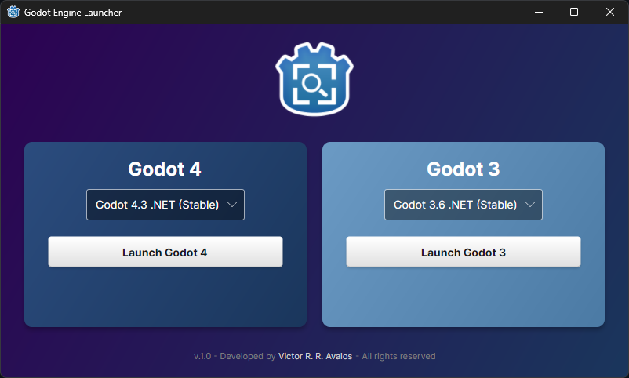
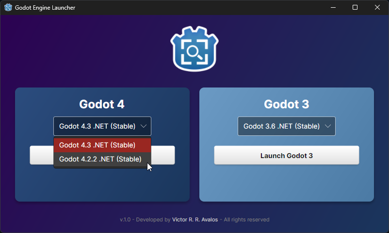

# 🚀 Godot Engine Launcher

<div align="center">
    
    <h3>A modern and efficient launcher for managing multiple Godot Engine versions</h3>
</div>

## ✨ Features

- **Multiple version support**: Easily run Godot 3.x and 4.x at any time
- **Custom Configuration**: Easy JSON-based configuration to manage Godot versions
- **Clean Interface**: Modern, intuitive user interface
- **Windows Support**: Designed for Windows environments

## 📸 Screenshots

<div align="center">
    <div style="display: flex; justify-content: center; gap: 20px;">
        
        
    </div>
</div>

## 🔧 Installation

1. Download the latest release from the [Releases](/releases) page
2. Extract the zip file
3. Run `GodotEngineLauncher.exe`

No installation required - the application is portable!


## ⚙️ Configuration

The launcher uses a `godot-launcher.json` file to manage separate Godot 3.x and 4.x versions.  
Here's the detailed structure (you'll probably want to modify it for your needs):

### JSON Structure
```json
{
  "godot3Versions": [
    {
      "version": "3.6",
      "displayText": "Godot 3.6 .NET (Stable)",
      "path": "C:\\Godot\\godot-builds\\releases\\Godot_v3.6-stable_mono_win64\\Godot_v3.6-stable_mono_win64.exe",
      "isDefault": true
    }
  ],
  "godot4Versions": [
    {
      "version": "4.3",
      "displayText": "Godot 4.3 .NET (Stable)",
      "path": "C:\\Godot\\godot-builds\\releases\\Godot_v4.3-stable_mono_win64\\Godot_v4.3-stable_mono_win64.exe",
      "isDefault": true
    }
  ]
}
```

### Configuration Properties

- `godot3Versions`: Array of Godot 3.x installations
- `godot4Versions`: Array of Godot 4.x installations

Each version entry has these properties:
- `version`: Version number identifier (e.g., "3.6", "4.3")
- `displayText`: User-friendly name shown in the launcher interface
- `path`: Full file path to the Godot executable
- `isDefault`: Boolean flag to mark the default version for each major version (3.x and 4.x)

### Important Notes

1. You can have multiple versions for both Godot 3 and Godot 4
2. Each major version group (3.x and 4.x) should have exactly one default version (isDefault: true)
3. Paths must use double backslashes (`\\`) for Windows file paths
4. The displayText can be customized to show additional information (e.g., .NET, Stable, Beta)

### Example Path Formats

Windows paths can be written as:
```json
"path": "C:\\Godot\\godot-builds\\releases\\Godot_v4.3-stable_mono_win64\\Godot_v4.3-stable_mono_win64.exe"
```
## 👨‍💻 Development

Developed by Victor R. R. Avalos - All rights reserved
